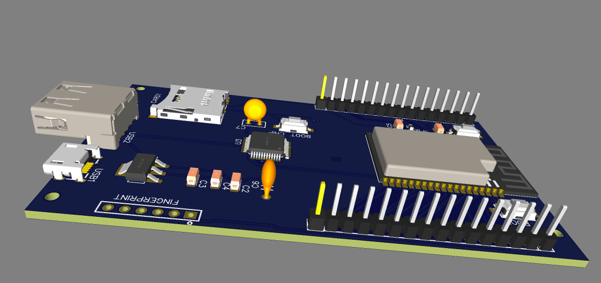
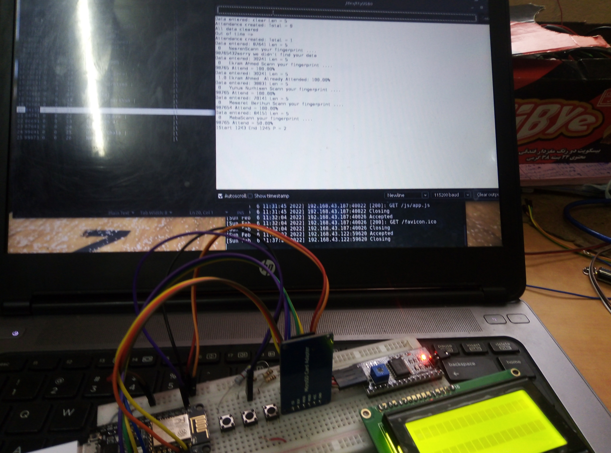

# The ESP code for General Purpose Attendance Monitoring Devece

Since I have ESP8266 in my hand, The code is written for ESP8266. But the device is designed using ESP32-WROVER. So changing the code is needed when the circuit is printed.

## The PCB design of the device.

## The prototype with ESPO8266

## Interested to make product? I am also interested. <a target="new" href="https://Nes-cmd.github.io"> Contact me</a>